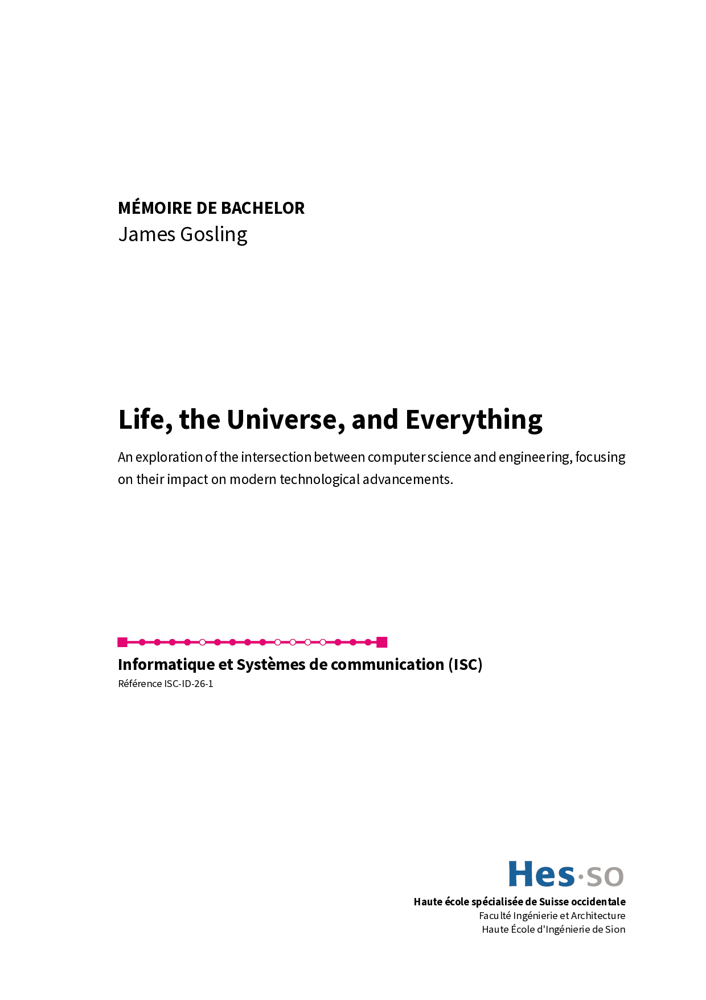
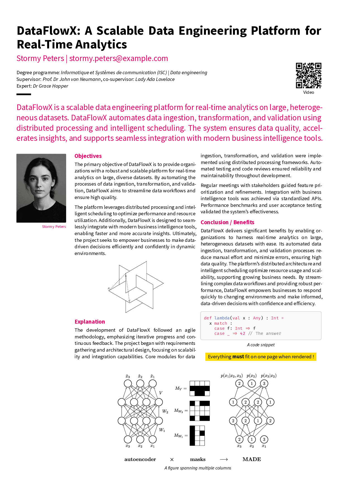
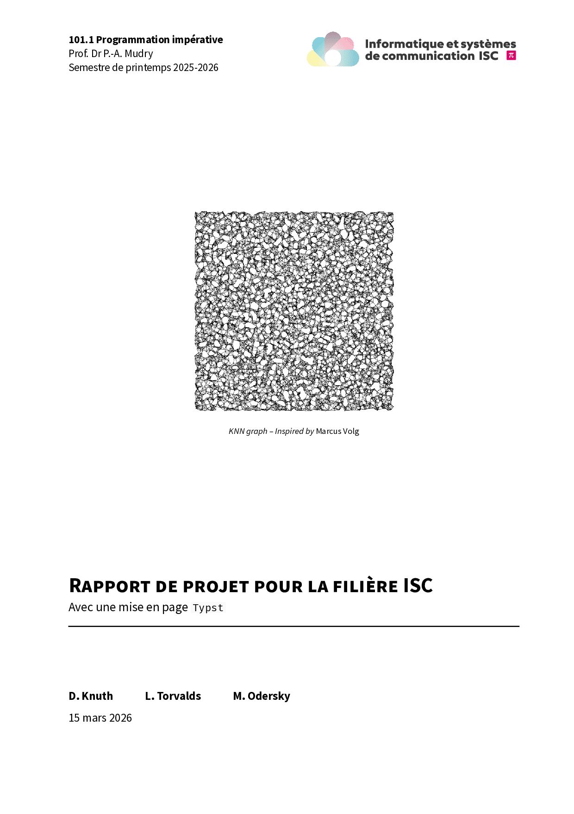
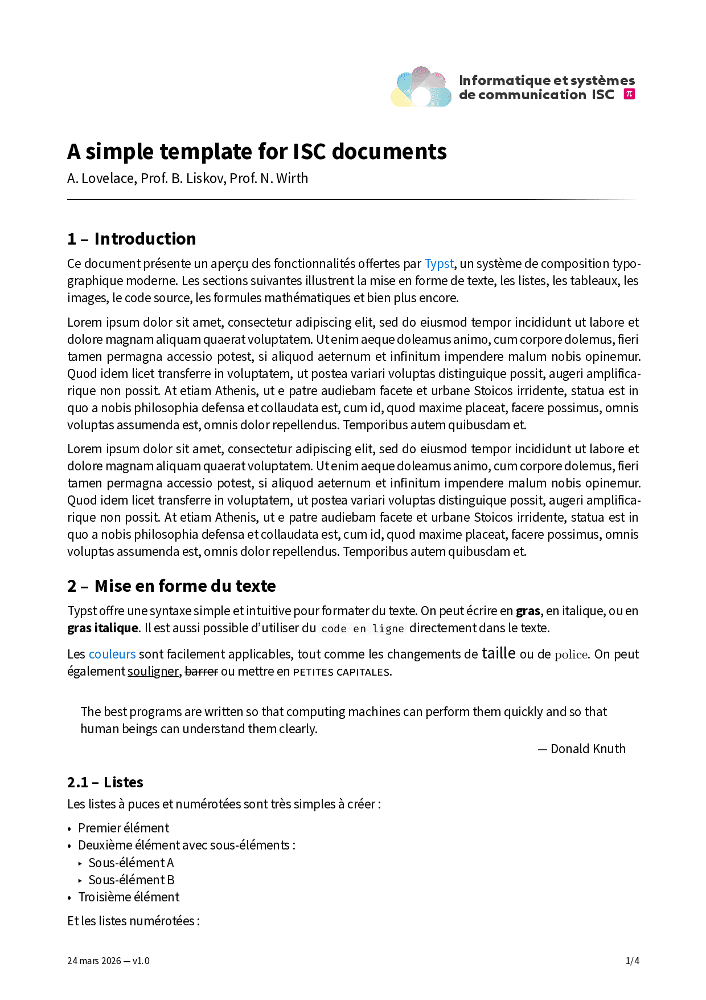
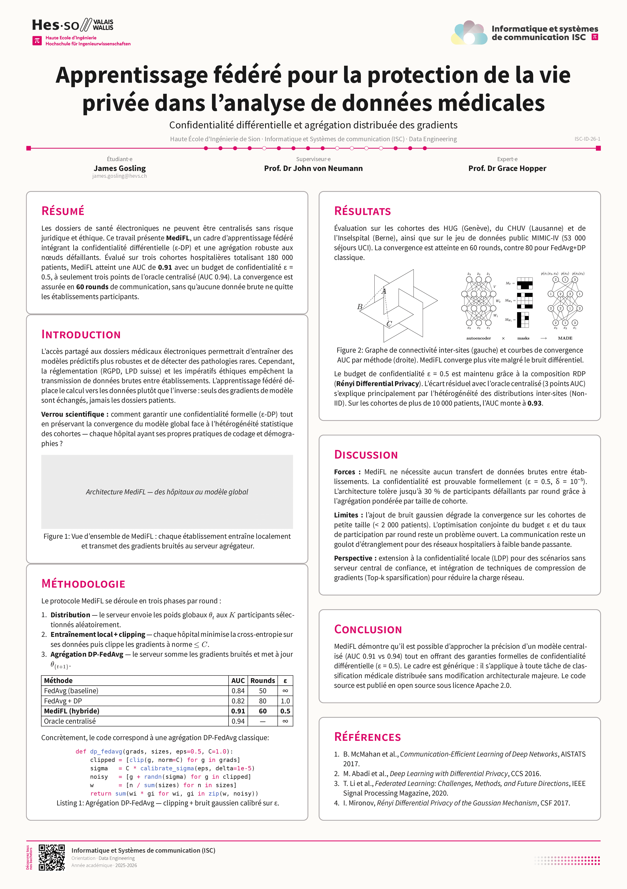
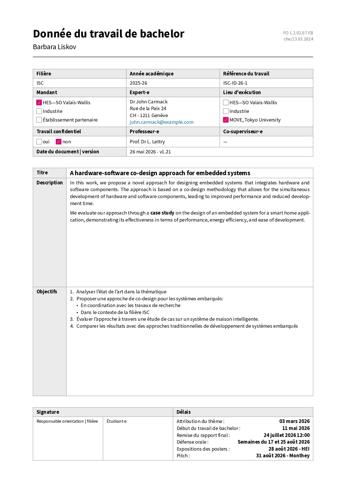

<picture>
  <source media="(prefers-color-scheme: dark)"
          srcset="https://raw.githubusercontent.com/ISC-HEI/isc-logos/main/white/ISC%20Logo%20inline%20white%20v3%20-%20large.webp">
  
</picture>

[](https://github.com/ISC-HEI/isc-hei-report/stargazers)
[](https://github.com/ISC-HEI/isc-hei-report/releases)
[](./LICENSE)
[](https://typst.app/)

# Document templates for the ISC curricula

These are the official templates for reports, bachelor theses, project executive summaries and posters for the [ISC degree programme](https://isc.hevs.ch/) at the School of Engineering in Sion. They are authored in [Typst](https://typst.app/) so that students can focus on content rather than on layout, and they are published on the Typst universe as the `isc-hei-*` package family — nothing to clone, `typst init` is enough to get started.

## Preview

<p align="center">
  <a href="examples/bachelor_thesis.pdf?raw=true"></a>
  <a href="examples/exec_summary.pdf?raw=true"></a>
  <a href="examples/report.pdf?raw=true"></a>
  <a href="examples/document.pdf?raw=true"></a>
  <a href="examples/poster.pdf?raw=true"></a>
  <a href="examples/tb_assignment.pdf?raw=true"></a>
</p>

## Features

- **Six ready-made templates** — `document`, `report`, `bthesis`, `exec-summary`, `poster` and `tb-assignment`, each with its own cover page and sensible defaults
- **Localised strings** — every caption, heading and boilerplate string comes from `i18n.json`, complete in French, English and German
- **ISC visual identity** — official logos, colours and the institutional fonts, applied consistently across all templates
- **Syntax-highlighted listings** — source files are included verbatim with a selectable colour theme from `src/themes/`
- **Academic plumbing included** — table of contents, list of figures, listings and tables, acronym table, bibliography and appendices
- **Compiled examples** — a fully-populated PDF for each template lives in `./examples/`, ready to be used as a reference

## Quick Start

The fastest path is the [Typst web application](https://typst.app/): start a new project from any `isc-hei-*` template and voilà.

Locally, install Typst, then pick the template you need:

```bash
# A project report — the most common starting point
typst init @preview/isc-hei-report

# Other available templates
typst init @preview/isc-hei-document
typst init @preview/isc-hei-bthesis
typst init @preview/isc-hei-exec-summary
typst init @preview/isc-hei-poster
typst init @preview/isc-hei-tb-assignment

# Pin a specific version if you need to
typst init @preview/isc-hei-bthesis:0.8.1

# Compile once, or recompile on every save
typst compile report.typ
typst watch report.typ
```

VS Code and VSCodium users can also compile directly from the editor through the [Tinymist](https://marketplace.visualstudio.com/items?itemName=myriad-dreamin.tinymist) extension.

## Dependencies

Writing a document only needs `typst` and the ISC fonts. The remaining tools are used by the maintenance recipes in the `Justfile`.

| Tool | Required for | Linux (Debian/Ubuntu) | macOS (Homebrew) |
| --- | --- | --- | --- |
| **typst** | Compiling any document | [GitHub release](https://github.com/typst/typst/releases) tarball | `brew install typst` |
| **ISC fonts** | Correct typography when compiling locally | `cd src/fonts && source install_fonts.sh` | `cd src/fonts && source install_fonts.sh` |
| **just** | Running the packaging, test and thumbnail recipes | `sudo apt install just` | `brew install just` |
| **pngquant** | Compressing the preview thumbnails | `sudo apt install pngquant` | `brew install pngquant` |
| **zopflipng** | Lossless final pass on those thumbnails | `sudo apt install zopfli` | `brew install zopfli` |

All the fonts are released under the [SIL Open Font License](https://openfontlicense.org/), so there is no redistribution issue with the download script.

## Questions and help

If you need any help installing or running these templates, get in touch with the maintainer [pmudry](https://github.com/pmudry). Pull requests and issues are welcome — see [`CONTRIBUTING.md`](./CONTRIBUTING.md). Have fun writing things!

---

## License

Copyright © 2024-2026 Pierre-André Mudry et al. / ISC — HES-SO Valais. Released under the [MIT License](./LICENSE).

You are free to use, modify and redistribute these templates, including for commercial purposes, as long as the copyright notice and the licence text are kept.

---

*Made with ♥ by mui, 2026*
